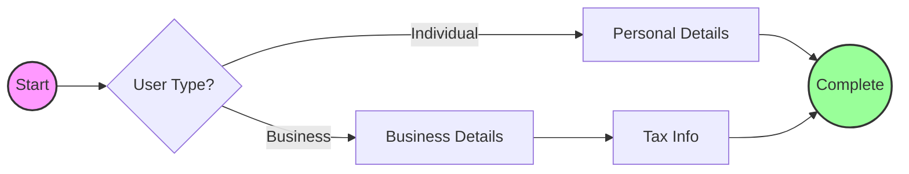

# @neuraform/core

[](https://www.npmjs.com/package/@neuraform/core)
[](https://opensource.org/licenses/MIT)
[](https://www.typescriptlang.org/)

**The Brain of Your Forms.** Framework-agnostic graph-based form engine that eliminates "condition hell" in complex multi-step flows.

## 🚀 Why Graph-Based?

Traditional linear forms (`[Step1, Step2, Step3]`) break when logic gets complex. **NeuraForm** treats your form as a **Directed Acyclic Graph (DAG)**.



| Feature | ❌ Linear Forms | ✅ NeuraForm (Graph) |
| :--- | :--- | :--- |
| **Logic** | Nested `if/else` spaghetti | Declarative Edges |
| **Navigation** | Hardcoded implementation | Auto-computed Paths |
| **Progress** | `Step / Total` (Inaccurate) | Weighted Path Calculation |
| **Validation** | Field-level only | Predictive Path Validation |

## 📦 Installation

```bash
npm install @neuraform/core
```

## ⚡ Quick Start

[](https://stackblitz.com/edit/node?file=index.js&dependencies=@neuraform/core)

```javascript
import { NeuraFormEngine } from '@neuraform/core';

// 1. Define your map (Schema)
const schema = {
  id: 'onboarding-flow',
  initial: 'welcome',
  states: {
    welcome: {
      on: { NEXT: 'userType' }
    },
    userType: {
      on: {
        BUSINESS: 'businessDetails',
        INDIVIDUAL: 'personalDetails'
      }
    },
    businessDetails: { on: { NEXT: 'complete' } },
    personalDetails: { on: { NEXT: 'complete' } },
    complete: { type: 'final' }
  }
};

// 2. Initialize the engine
const engine = new NeuraFormEngine({
  schema,
  autoSave: true, // Auto-saves to IndexedDB
  onComplete: (data) => console.log('🎉 Form Completed:', data)
});

await engine.start();

// 3. Drive!
console.log(engine.getCurrentState()); // 'welcome'
await engine.transition('NEXT'); 
console.log(engine.getCurrentState()); // 'userType'
```

## 📚 Documentation

- [**Core Concepts**](https://github.com/Mehulbirare/neura-form/blob/main/docs/core-concepts.md) - Learn about Nodes, Edges, and Travelers.
- [**API Reference**](https://github.com/Mehulbirare/neura-form/blob/main/docs/api-reference.md) - Full method documentation.
- [**Examples**](https://github.com/Mehulbirare/neura-form/tree/main/examples) - Real-world usage.

## 📄 License

MIT © [Mehul Birare](https://github.com/Mehulbirare)
